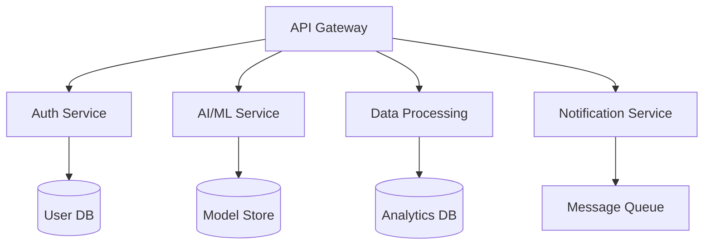

# 🌟 TAR XEMO 🌟
### *AI Architect | Full-Stack Innovator | Open-Source Pioneer*

<div align="center">


[](https://user-badge.committers.top/tanzania_private/tarxemo)
[](https://mtawa.tarxemo.com/)
[](mailto:code@tarxemo.com)
[](https://www.linkedin.com/in/tar-xemo)


</div>

---

## 🚀 **About Me**

```typescript
interface Developer {
  name: string;
  role: string[];
  location: string;
  expertise: string[];
  currentFocus: string;
  languages: string[];
}

const tarxemo: Developer = {
  name: "Tar Xemo",
  role: ["AI Architect", "Full-Stack Engineer", "Tech Innovator"],
  location: "Dodoma, Tanzania 🇹🇿",
  expertise: [
    "Artificial Intelligence & Machine Learning",
    "Microservices Architecture",
    "Cloud-Native Development",
    "Natural Language Processing",
    "Computer Vision"
  ],
  currentFocus: "Building next-generation AI solutions",
  languages: ["English", "Swahili", "Python", "TypeScript", "Go"]
};

// Always ready to innovate! 🚀
console.log("Let's revolutionize technology together!");
```

---

## 🏆 **Achievements & Recognition**

<div align="center">

[](https://committers.top/tanzania_private)
[](https://github.com/tarxemo)
[](https://github.com/tarxemo?tab=repositories)

</div>

---

## 🛠️ **Technology Arsenal**

### **🧠 AI & Machine Learning**
<div align="center">


</div>

### **🌐 Frontend Development**
<div align="center">


</div>

### **⚡ Backend & APIs**
<div align="center">


</div>

### **📱 Mobile Development**
<div align="center">


</div>

### **☁️ Cloud & DevOps**
<div align="center">


</div>

### **🗄️ Databases & Storage**
<div align="center">


</div>

---

## 🚀 **Featured Innovation Projects**

<table>
<tr>
<td width="50%">

### 🤖 **AI-Powered Solutions**
- **🐓 Leonidas Farm AI** - *Revolutionary poultry management with computer vision*
  - `Django` `React` `TensorFlow` `Computer Vision`
  - Real-time health monitoring & predictive analytics
- **🧠 SwahiliGPT** - *Large Language Model for Swahili*
  - `Transformers` `PyTorch` `Hugging Face`
  - First open-source Swahili conversational AI
- **🔍 AgriSense** - *Crop disease detection via satellite imagery*
  - `FastAPI` `Computer Vision` `GIS` `ML`

</td>
<td width="50%">

### 🌐 **Full-Stack Applications**
- **🗳️ UDOM Campus Votes** - *Transparent election platform*
  - `Django` `React` `WebSockets` `Real-time Analytics`
- **🎙️ Swahili Voice Dataset** - *Crowdsourced speech collection*
  - `Vue.js` `Web Audio API` `NLP` `Cloud Storage`
- **📊 DataViz Pro** - *Interactive data visualization suite*
  - `Angular` `D3.js` `Python` `Microservices`

</td>
</tr>
</table>

### 🏗️ **Microservices Architecture**


---

## 📊 **GitHub Analytics**

<div align="center">


</div>

<div align="center">

[](https://git.io/streak-stats)

</div>

### 📈 **Contribution Graph**
[](https://github.com/tarxemo)

---

## 🏆 **GitHub Trophies**
<div align="center">

[](https://github.com/ryo-ma/github-profile-trophy)

</div>

---

## 🌍 **Open Source Impact**

<div align="center">

### **🇹🇿 Tanzania GitHub Rankings**
[](https://committers.top/tanzania_private)

*Proudly contributing to Tanzania's tech ecosystem and inspiring the next generation of developers!*

</div>

---

## 🎯 **Current Focus Areas**

<div align="center">

```python
current_projects = {
    "🚀 AI Research": "Developing multilingual NLP models for African languages",
    "🌍 Open Source": "Contributing to TensorFlow, Django, and React ecosystems", 
    "📚 Knowledge Sharing": "Mentoring young developers in Tanzania",
    "🏢 Consulting": "Helping startups integrate AI into their products",
    "🎓 Education": "Creating AI/ML courses in Swahili"
}

for project, description in current_projects.items():
    print(f"{project}: {description}")
```

</div>

---

## 📫 **Let's Connect & Collaborate**

<div align="center">

### *"Innovation distinguishes between a leader and a follower"* - Steve Jobs

[](https://mtawa.tarxemo.com/)
[](mailto:code@tarxemo.com)
[](https://www.linkedin.com/in/tar-xemo)

**🤝 Open to collaborate on:**
- 🤖 AI/ML projects with social impact
- 🌍 Open-source initiatives
- 🚀 Innovative startup ventures
- 📚 Educational technology solutions

</div>

---

<div align="center">

**⚡ Fun Fact:** *I debug code faster than I debug my life choices!* 😄

*Last updated: January 2025*


</div>
