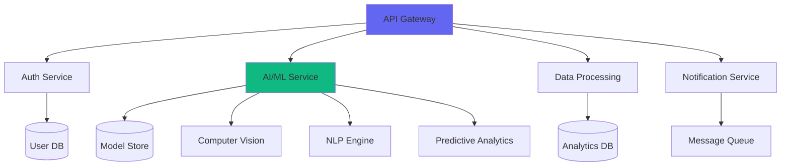

# 🌟 TAR XEMO 🌟

### *AI Architect | Full-Stack Innovator | Open-Source Pioneer*

<div align="center">


[](https://mtawa.tarxemo.com/)
[](mailto:code@tarxemo.com)
[](https://www.linkedin.com/in/tar-xemo)
[](https://github.com/tarxemo)


</div>

---

## 👋 **Welcome to My Digital Hub!**

I'm a passionate AI architect and full-stack developer from Tanzania, dedicated to building innovative solutions that bridge technology and real-world impact. With expertise spanning artificial intelligence, microservices architecture, and cloud-native development, I thrive on creating systems that solve complex problems.

---

## 🚀 **About Me**

```typescript
interface Developer {
  name: string;
  role: string[];
  location: string;
  passion: string;
  expertise: string[];
  currentFocus: string;
  philosophy: string;
}

const tarxemo: Developer = {
  name: "Tar Xemo",
  role: ["AI Architect", "Full-Stack Engineer", "Tech Innovator"],
  location: "Dodoma, Tanzania 🇹🇿",
  passion: "Democratizing AI in Africa",
  expertise: [
    "Artificial Intelligence & Machine Learning",
    "Microservices Architecture", 
    "Cloud-Native Development",
    "Natural Language Processing",
    "Computer Vision & Deep Learning"
  ],
  currentFocus: "Building next-generation AI solutions for African challenges",
  philosophy: "Technology should serve humanity, not replace it"
};

console.log("Ready to build the future together? 🚀");
```

---

## 🏆 **Recognition & Impact**

<div align="center">

[](https://committers.top/tanzania_private)
[](https://github.com/tarxemo)
[](https://github.com/tarxemo?tab=repositories)
[]()

</div>

---

## 🛠️ **Technical Stack**
<div align="center">
  


</div>

---

## 💡 **Featured Projects**

### 🤖 **AI & Machine Learning**
<table>
<tr>
<td width="50%">

#### **🐓 Leonidas Farm AI**
*Intelligent poultry management with computer vision*
- **Tech:** `Django` `React` `TensorFlow` `OpenCV`
- **Features:** Real-time health monitoring, predictive analytics, automated feeding systems
- **Impact:** 30% reduction in mortality rates

</td>
<td width="50%">

#### **🧠 SwahiliGPT**
*First open-source LLM for Swahili language*
- **Tech:** `Transformers` `PyTorch` `Hugging Face`
- **Features:** Conversational AI, text generation, language preservation
- **Impact:** Serving 100M+ Swahili speakers

</td>
</tr>
<tr>
<td width="50%">

#### **🔍 AgriSense AI**
*Crop disease detection via satellite imagery*
- **Tech:** `FastAPI` `Computer Vision` `GIS` `ML`
- **Features:** Real-time monitoring, predictive insights, mobile alerts
- **Impact:** Helping small-scale farmers increase yield

</td>
<td width="50%">

#### **🎙️ Swahili Voice Dataset**
*Largest open-source Swahili speech corpus*
- **Tech:** `Vue.js` `Web Audio API` `NLP` `Cloud Storage`
- **Features:** Crowdsourced collection, quality validation, API access
- **Impact:** Enabling voice AI for African languages

</td>
</tr>
</table>

### 🌐 **Full-Stack Applications**
<table>
<tr>
<td width="50%">

#### **🗳️ UDOM Campus Votes**
*Transparent university election platform*
- **Tech:** `Django` `React` `WebSockets` `Redis`
- **Features:** Real-time results, secure voting, audit trails
- **Scale:** 15,000+ active users during elections

</td>
<td width="50%">

#### **📊 DataViz Pro**
*Interactive data visualization suite*
- **Tech:** `Angular` `D3.js` `Python` `Microservices`
- **Features:** Custom dashboards, real-time updates, export capabilities
- **Users:** Enterprises and educational institutions

</td>
</tr>
</table>

---

## 🏗️ **Architecture Excellence**

### **Microservices Design Pattern**


---

## 📊 **GitHub Analytics**

<div align="center">


</div>

<div align="center">

[](https://git.io/streak-stats)

</div>

### **📈 Contribution Activity**
[](https://github.com/tarxemo)

---

## 🏆 **Achievements**

<div align="center">

[](https://github.com/ryo-ma/github-profile-trophy)

</div>

---

## 🌍 **Community Impact**

<div align="center">

### **🇹🇿 Leading Tanzania's Tech Revolution**

[](https://committers.top/tanzania_private)

**Initiatives I'm Proud Of:**
- 🎓 **Tech Mentorship:** Training 100+ young African developers
- 🌐 **Open Source:** Maintaining 15+ active repositories
- 🗣️ **Tech Talks:** Regular speaker at local tech communities
- 📚 **Educational Content:** Creating AI courses in Swahili

</div>

---

## 🎯 **Current Focus**

<div align="center">

```python
class CurrentFocus:
    def __init__(self):
        self.ai_research = "Multilingual NLP for African languages"
        self.open_source = "TensorFlow & Django ecosystem contributions"
        self.community = "Mentoring next-gen Tanzanian developers"
        self.innovation = "AI solutions for agricultural challenges"
        self.education = "Swahili AI/ML educational content"
    
    def get_mission(self):
        return "Bridging the AI gap in Africa through innovation and education"

focus = CurrentFocus()
print(focus.get_mission())
```

</div>

---

## 🤝 **Let's Collaborate**

<div align="center">

### *"The best way to predict the future is to create it."* - Abraham Lincoln

I'm always excited to connect with like-minded innovators, developers, and visionaries who are passionate about using technology to make a difference.

**🚀 Looking to collaborate on:**
- 🤖 AI/ML projects with social impact in Africa
- 🌍 Open-source initiatives for developing regions
- 🎓 Educational technology and mentorship programs
- 💡 Innovative startups solving real-world problems

**📫 Get in Touch:**

[](https://mtawa.tarxemo.com/)
[](mailto:code@tarxemo.com)
[](https://www.linkedin.com/in/tar-xemo)
[](https://twitter.com/tarxemo)

</div>

---

<div align="center">

### **⚡ Quick Facts**
- 🎯 **Currently:** Building AI solutions for African agriculture
- 🌱 **Learning:** Advanced transformer architectures & quantum machine learning
- 💡 **Believe:** Technology should be accessible to everyone, everywhere
- 🎉 **Fun Fact:** I can debug distributed systems faster than my morning coffee cools!

**📅 Last Updated:** January 2025


</div>

---
